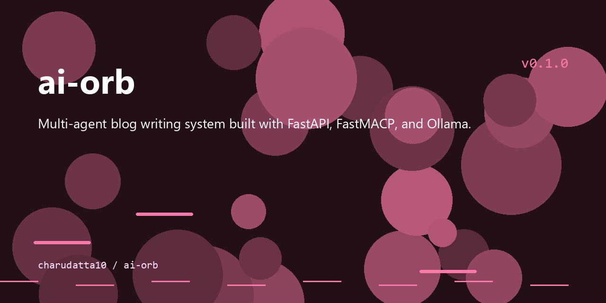

# ai-orb

<p align="center">
  
</p>


A multi-agent blog writing system built with FastAPI, FastMACP, and Ollama.

## What is this?

ai-orb is a multi-agent blog writing system that coordinates several LLM agents powered by Ollama. It uses FastMACP for agent communication and FastAPI to serve the application, with web scraping and PDF processing for research and knowledge extraction.

## Features

- Multi-agent architecture for blog content creation
- Web scraping capabilities for research
- PDF processing for knowledge extraction
- Ollama-powered LLM agents
- FastMACP for agent communication
- FastAPI for serving the application

## Install / Quickstart

Clone the repository:

```bash
git clone https://github.com/charudatta10/ai-orb.git
cd ai-orb
```

Install dependencies and run:

```bash
pip install -e .
invoke
```

## Usage

Connect to a local Ollama instance on `http://localhost:11434`, then serve the multi-agent blog writing system with FastAPI:

```bash
python -m src.main
```

## License

This project is licensed under the terms in [LICENSE.md](LICENSE.md).

<!-- Acknowledgment, References, Misc -->