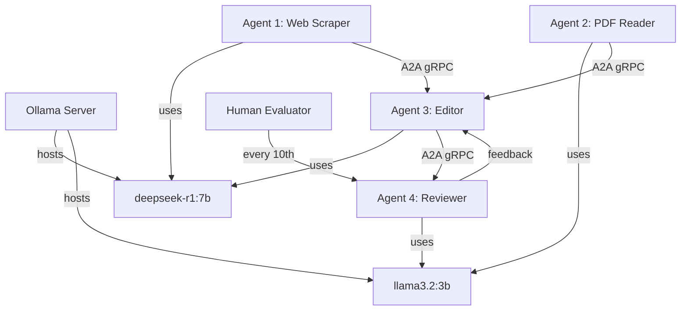

## Multi-Agent AI System with Ollama Local LLMs

Below is a comprehensive design for a multi-agent AI system using Ollama as a local LLM server with deepseek-r1:7b and llama3.2:3b models. The system incorporates four specialized agents with the specified capabilities and follows modern protocols for agent communication.

## System Architecture



## Core Components

### 1. Ollama Configuration

```python
# ollama_config.yaml
models:
  - name: deepseek-r1:7b
    parameters:
      temperature: 0.7
      max_tokens: 4096
  - name: llama3.2:3b
    parameters:
      temperature: 0.5
      max_tokens: 2048

server:
  host: localhost
  port: 11434
  gpu_layers: 20  # adjust based on your GPU
```

### 2. Agent Base Class (MCP Compliant)

```python
from abc import ABC, abstractmethod
import grpc
from mcp_protocol_pb2 import TaskRequest, TaskResponse
from mcp_protocol_pb2_grpc import MCPServiceStub

class Agent(ABC):
    def __init__(self, agent_id, model_name):
        self.agent_id = agent_id
        self.model_name = model_name
        self.mcp_stub = MCPServiceStub(grpc.insecure_channel('localhost:50051'))
        
    @abstractmethod
    def perform_task(self, task_input):
        pass
        
    def communicate(self, target_agent, message):
        """A2A communication using gRPC"""
        response = self.mcp_stub.SendMessage(
            TaskRequest(
                sender_id=self.agent_id,
                receiver_id=target_agent,
                content=message
            )
        )
        return response.content
```

### 3. Specialized Agents

#### Agent 1: Web Scraper

```python
from bs4 import BeautifulSoup
import requests
from typing import List, Dict

class WebScraperAgent(Agent):
    def __init__(self):
        super().__init__("web_scraper", "deepseek-r1:7b")
        self.search_tools = SearchTools()
        
    def perform_task(self, topic: str) -> Dict:
        """Collect data and generate initial draft"""
        # Web search and scraping
        search_results = self.search_tools.search_web(topic)
        cleaned_content = []
        
        for url in search_results[:5]:  # limit to top 5 results
            try:
                response = requests.get(url)
                soup = BeautifulSoup(response.text, 'html.parser')
                text = ' '.join([p.get_text() for p in soup.find_all('p')])
                cleaned_content.append(self.clean_text(text))
            except:
                continue
                
        # Generate draft using LLM
        prompt = f"Create a comprehensive draft about {topic} using the following information:\n\n" + \
                 '\n\n'.join(cleaned_content)
                 
        draft = self.query_llm(prompt)
        return {"draft": draft, "sources": search_results}
        
    def query_llm(self, prompt):
        # Implementation to query Ollama server
        pass
```

#### Agent 2: PDF Reader

```python
import PyPDF2
from io import BytesIO

class PDFReaderAgent(Agent):
    def __init__(self):
        super().__init__("pdf_reader", "llama3.2:3b")
        
    def perform_task(self, pdf_urls: List[str]) -> Dict:
        """Analyze PDFs and generate insights"""
        extracted_text = []
        
        for url in pdf_urls:
            try:
                response = requests.get(url)
                pdf_file = BytesIO(response.content)
                reader = PyPDF2.PdfReader(pdf_file)
                text = '\n'.join([page.extract_text() for page in reader.pages])
                extracted_text.append(self.clean_text(text))
            except:
                continue
                
        # Generate insights using LLM
        prompt = f"Extract key insights from these documents:\n\n" + \
                 '\n\n'.join(extracted_text)
                 
        insights = self.query_llm(prompt)
        return {"insights": insights, "pdfs_processed": len(pdf_urls)}
```

#### Agent 3: Editor (with Memory)

```python
from typing import Dict, List

class EditorAgent(Agent):
    def __init__(self):
        super().__init__("editor", "deepseek-r1:7b")
        self.memory = []  # Simple memory implementation
        self.draft_history = []
        
    def perform_task(self, inputs: Dict) -> Dict:
        """Merge and refine content from multiple sources"""
        web_draft = inputs.get("web_draft", "")
        pdf_insights = inputs.get("pdf_insights", "")
        
        # Merge content
        prompt = f"Merge and refine the following content into a coherent draft:\n\n" + \
                 f"Web Content:\n{web_draft}\n\nPDF Insights:\n{pdf_insights}"
                 
        refined_draft = self.query_llm(prompt)
        
        # Store in memory
        self.memory.append({
            "input": inputs,
            "output": refined_draft,
            "timestamp": datetime.now()
        })
        self.draft_history.append(refined_draft)
        
        return {"refined_draft": refined_draft}
```

#### Agent 4: Reviewer

```python
class ReviewerAgent(Agent):
    def __init__(self):
        super().__init__("reviewer", "llama3.2:3b")
        self.draft_count = 0
        
    def perform_task(self, draft: str) -> Dict:
        """Evaluate draft quality and provide feedback"""
        self.draft_count += 1
        
        # Check if human evaluation is needed
        if self.draft_count % 10 == 0:
            return {"action": "human_evaluation", "draft": draft}
            
        # LLM-based evaluation
        prompt = f"Critically evaluate this draft and provide a score from 1-10:\n\n{draft}\n\n" + \
                 "Provide specific feedback for improvement."
                 
        evaluation = self.query_llm(prompt)
        
        # Extract score (simple implementation)
        score = self.extract_score(evaluation)
        
        if score >= 8:
            return {"action": "approve", "score": score, "feedback": evaluation}
        else:
            return {"action": "revise", "score": score, "feedback": evaluation}
```

### 4. System Orchestrator

```python
import threading
from queue import Queue

class AISystemOrchestrator:
    def __init__(self):
        self.agent1 = WebScraperAgent()
        self.agent2 = PDFReaderAgent()
        self.agent3 = EditorAgent()
        self.agent4 = ReviewerAgent()
        self.task_queue = Queue()
        self.results = {}
        
    def process_topic(self, topic: str, pdf_urls: List[str]):
        # Parallel execution of Agents 1 and 2
        def run_agent1():
            web_result = self.agent1.perform_task(topic)
            self.results['web'] = web_result
            
        def run_agent2():
            pdf_result = self.agent2.perform_task(pdf_urls)
            self.results['pdf'] = pdf_result
            
        t1 = threading.Thread(target=run_agent1)
        t2 = threading.Thread(target=run_agent2)
        t1.start()
        t2.start()
        t1.join()
        t2.join()
        
        # Sequential processing with Agents 3 and 4
        iteration_count = 0
        while True:
            iteration_count += 1
            
            # Agent 3 processing
            editor_input = {
                "web_draft": self.results['web']['draft'],
                "pdf_insights": self.results['pdf']['insights']
            }
            editor_output = self.agent3.perform_task(editor_input)
            
            # Agent 4 review
            review_result = self.agent4.perform_task(editor_output['refined_draft'])
            
            if review_result['action'] == 'approve':
                return review_result
            elif review_result['action'] == 'human_evaluation':
                human_feedback = self.get_human_feedback(review_result['draft'])
                self.results['web']['draft'] = human_feedback.get('revised_draft', '')
                continue
            else:
                # Incorporate feedback into next iteration
                self.results['web']['draft'] = review_result['feedback']
```

### 5. Protocol Implementations

#### MCP (Model Context Protocol) Implementation

```python
# mcp_protocol.proto
syntax = "proto3";

service MCPService {
    rpc SendMessage (TaskRequest) returns (TaskResponse);
    rpc GetTool (ToolRequest) returns (ToolResponse);
}

message TaskRequest {
    string sender_id = 1;
    string receiver_id = 2;
    string content = 3;
}

message TaskResponse {
    string content = 1;
    int32 status_code = 2;
}

message ToolRequest {
    string tool_name = 1;
    map<string, string> parameters = 2;
}

message ToolResponse {
    bytes tool_data = 1;
    int32 status_code = 2;
}
```

#### A2A (Agent-to-Agent) gRPC Service

```python
# a2a_service.py
import grpc
from concurrent import futures
from mcp_protocol_pb2_grpc import add_MCPServiceServicer_to_server
from mcp_protocol_pb2 import TaskResponse

class A2AService(MCPServiceServicer):
    def SendMessage(self, request, context):
        # Route message to appropriate agent
        target_agent = self.get_agent(request.receiver_id)
        response = target_agent.receive_message(request.sender_id, request.content)
        return TaskResponse(content=response, status_code=200)
        
def serve():
    server = grpc.server(futures.ThreadPoolExecutor(max_workers=10))
    add_MCPServiceServicer_to_server(A2AService(), server)
    server.add_insecure_port('[::]:50051')
    server.start()
    server.wait_for_termination()
```

## Deployment Setup

1. **Ollama Installation**:
   ```bash
   curl -fsSL https://ollama.com/install.sh | sh
   ollama pull deepseek-r1:7b
   ollama pull llama3.2:3b
   ```

2. **System Requirements**:
   - Minimum 16GB RAM (32GB recommended)
   - NVIDIA GPU with at least 8GB VRAM for optimal performance
   - Python 3.9+

3. **Install Dependencies**:
   ```bash
   pip install grpcio protobuf beautifulsoup4 requests PyPDF2 python-dotenv
   ```

4. **Running the System**:
   ```bash
   # Start Ollama server
   ollama serve &
   
   # Start A2A gRPC service
   python a2a_service.py &
   
   # Main system
   python main.py --topic "Quantum Computing" --pdfs url1 url2
   ```

## Key Features

1. **Modular Design**: Each agent can be replaced or upgraded independently
2. **Protocol Compliance**: Uses MCP for tool integration and gRPC for A2A communication
3. **Iterative Refinement**: Built-in feedback loop with quality control
4. **Human-in-the-Loop**: Regular human evaluation points
5. **Resource Optimization**: Smaller model (llama3.2:3b) for less critical tasks

## Scaling Considerations

1. **Horizontal Scaling**: Agents can be distributed across multiple machines
2. **Load Balancing**: gRPC server can handle multiple concurrent requests
3. **Model Swapping**: Models can be changed via Ollama without system restart
4. **Monitoring**: Can integrate with Prometheus for performance tracking

This system provides a robust framework for collaborative AI content generation while maintaining flexibility and scalability through modern protocols and local LLM execution.